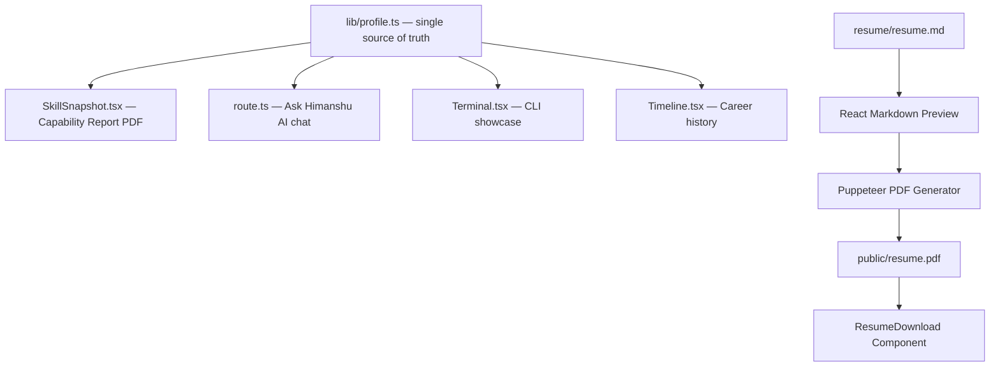

# Himanshu Sharma — Technical Specialist & AI Builder Portfolio

> Enterprise-grade personal portfolio showcasing expertise in live broadcasting infrastructure, AI & agentic systems, SaaS product engineering, platform reliability, and AV/enterprise networking.

---

## Table of Contents

* Overview
* Live Demo
* Features
* Technology Stack
* Architecture
* Local Development Setup
* Installation Guide
* Running the Application
* Resume System Architecture
* Markdown → Preview → PDF Pipeline
* GitHub Actions Automation
* Vercel Deployment
* Engineering Case Studies
* Ask Himanshu Engineering Chat
* Repository Structure
* Development Workflow
* Troubleshooting Guide
* Roadmap
* License

---

## Project Overview

This portfolio is designed as an enterprise-grade engineering showcase, not a traditional resume website.

The platform demonstrates:

* Live Broadcasting & Streaming Infrastructure (NHL / AWS MediaLive)
* AI & Agentic Systems (Claude, Ollama, RAG, ChromaDB, n8n)
* SaaS Product Building (The KPI Hub — B2B intelligence platform)
* Platform Engineering & Reliability (99.97%+ uptime focus)
* AV Systems & Enterprise Networking (Q-SYS, Crestron, AMX, HDBaseT)
* Resume Automation (Markdown → PDF via GitHub Actions)

---

## Live Demo

**Production:** https://himanshu-sharma-portfolio-eosin.vercel.app

---

## Features

### Hero Section

* Animated professional title rotation
* Modern enterprise UI
* Responsive design
* Social links (GitHub, LinkedIn)
* Capability Report download (jsPDF, in-browser generation)

---

### Skills Dashboard

Technology visualization for:

* AWS MediaLive / MediaPackage / CloudWatch
* Docker / GitHub Actions / Vercel
* Claude / Ollama / ChromaDB / n8n / Open WebUI
* Next.js 15 / TypeScript / Supabase / Tailwind CSS
* Q-SYS / Crestron / AMX / HDBaseT / VLAN 802.1Q

---

### Terminal Experience

Interactive terminal showcasing:

* `aether status` — live AI stack (Claude, Ollama, ChromaDB, n8n, OpenWebUI)
* `himanshu@forge` prompt
* Broadcasting uptime and feed count
* `OPEN_TO_WORK=true` availability flag

---

### Engineering Timeline

Professional experience visualization:

* Technical Specialist — Broadcasting & Streaming / GlobalXperts (NHL Project) / 2025–Present
* Founder & CEO / The KPI Hub / 2025–Present
* AV Systems & Enterprise Network Specialist / Various Clients / ~2019–2025

Certifications:

* AWS MediaLive & MediaPackage Specialist (Feb 2026)
* ServiceNow Certified
* VibeCon 2025 Top 300 India Builder

---

### Projects Section

Showcases:

* The KPI Hub — B2B SaaS intelligence platform (Live)
* AetherAI — Self-hosted, privacy-first AI Operating System (Open Source)
* PolyMind — Multi-LLM platform with RAG (Active)
* Lumina Numerology — Offline PWA numerology app (Live)

---

### Ask Himanshu Engineering Chat

Route: `/engineering`

Keyword-matched AI assistant covering:

* Live broadcasting & streaming infrastructure
* AI & agentic systems (Claude, Ollama, RAG, multi-agent)
* SaaS building & product engineering
* Platform engineering & reliability
* AV systems & enterprise networking

---

## Resume Automation System

Source of truth:

```text
resume/resume.md
```

Automatically supports:

```text
Markdown
↓
Web Preview
↓
PDF Generation
↓
Download Button
↓
GitHub Actions
↓
Release Artifacts
```

---

## Technology Stack

### Frontend

```text
Next.js 15
React 19
TypeScript
TailwindCSS v4
Framer Motion
React Icons
Lucide Icons
React Markdown
```

---

### Resume System

```text
Markdown
Puppeteer
GitHub Actions
PDF Generation
```

---

### Capability Report (in-browser)

```text
jsPDF (browser-side, no server)
Profile data from lib/profile.ts
Downloads as: Himanshu-Sharma-Capability-Report.pdf
```

---

## Architecture



---

## Repository Structure

```text
Himanshu_Sharma-Portfolio

├── app
│   ├── engineering
│   │   ├── page.tsx
│   │   └── [slug]/page.tsx
│   │
│   ├── api
│   │   └── ask-engineer
│   │       └── route.ts
│   │
│   └── page.tsx
│
├── components
│   ├── Hero.tsx
│   ├── Navbar.tsx
│   ├── Skills.tsx
│   ├── Projects.tsx
│   ├── Experience.tsx
│   ├── Timeline.tsx
│   ├── Terminal.tsx
│   ├── SkillSnapshot.tsx
│   ├── Contact.tsx
│   ├── ResumeDownload.tsx
│   ├── FloatingChat.tsx
│   └── EngineeringChat.tsx
│
├── lib
│   └── profile.ts
│
├── src
│   ├── lib
│   │   └── github.ts
│   └── components
│       └── GitHubShowcase.tsx
│
├── content
│   └── case-studies
│       ├── cicd.md
│       ├── terraform-state.md
│       ├── devsecops.md
│       └── observability.md
│
├── resume
│   └── resume.md
│
├── build-scripts
│   └── generate-resume-pdf.js
│
├── public
│   └── resume.pdf
│
├── .github
│   └── workflows
│       └── resume-pdf.yml
│
└── README.md
```

---

## Local Setup Guide

### Clone Repository

```bash
git clone https://github.com/hsharmagxi-debug/Himanshu_Sharma-Portfolio.git

cd Himanshu_Sharma-Portfolio
```

---

### Install Dependencies

```bash
npm install
```

---

## Running Development Server

```bash
npm run dev
```

---

Access:

```text
http://localhost:3000
```

---

## Production Build Test

Always test before deployment:

```bash
npm run build
```

---

## Resume System

### Source of Truth

```text
resume/resume.md
```

Never edit PDFs manually. Only update `resume.md`.

---

### Resume Preview

Run:

```bash
npm run dev
```

Open:

```text
http://localhost:3000/test-resume
```

---

### PDF Generation

Generate:

```bash
node build-scripts/generate-resume-pdf.js
```

Generated file:

```text
public/resume.pdf
```

---

## GitHub Actions

Workflow: `.github/workflows/resume-pdf.yml`

Automatically:

```text
Push to main (resume/resume.md changed)
↓
Generate PDF
↓
Commit Artifact
↓
Auto-deploy via Vercel
```

---

## Vercel Deployment

Every push to `main` auto-deploys to production via Vercel CI/CD integration.

Manual deploy:

```bash
npm run build   # verify locally first
git add <files>
git commit -m "message"
git push origin main
```

---

## Pre-Deployment Checklist

Always verify:

```bash
npm run build
```

Must show:

```text
Compiled Successfully
Lint Passed
Types Passed
```

---

## Development Workflow

Create Branch:

```bash
git checkout -b feature/new-feature
```

Commit:

```bash
git add <files>
git commit -m "feat: add feature"
```

Push:

```bash
git push origin feature/new-feature
```

Merge:

```bash
git checkout main
git merge feature/new-feature
git push origin main
```

---

## Troubleshooting Guide

### Build Errors

```bash
npm run build
```

### Missing Modules

```bash
npm install
```

### ESLint `react/no-unescaped-entities`

Use `&apos;` for apostrophes in JSX: `I&apos;ve` not `I've`

### Resume Download Not Working

Verify `public/resume.pdf` exists.

### PDF Generator Timeout

Use:

```js
waitUntil: "domcontentloaded"
```

Instead of:

```js
networkidle0
```

### Port Already Used

```text
3000 busy → 3002 allocated
```

Access: `http://localhost:3002`

---

## Roadmap

### V1 — Completed

```text
Portfolio
Projects
Skills
Hero
Timeline
Contact
```

### V2 — Completed

```text
Resume Automation
Markdown Preview
PDF Generation
GitHub Actions
Engineering Pages
Ask Himanshu AI Chat
Capability Report (jsPDF)
```

### V3 — Planned

```text
Broadcasting case studies
AI architecture breakdowns
Knowledge center (AetherAI, PolyMind docs)
```

### V4 — Planned

```text
Build-Time RAG
AI Search
MiniSearch
Static Retrieval
```

---

## Architectural Decisions

### Why Markdown?

```text
Human Readable
Git Friendly
Easy Automation
Version Control
```

### Why jsPDF (in-browser)?

```text
No server cost
No Puppeteer dependency at runtime
Instant download
Works on Vercel serverless
```

### Why GitHub Actions?

```text
Free
Integrated
Version Controlled
Auto-deploys resume PDF on change
```

### Why Next.js 15?

```text
SEO
Performance
App Router
Type Safety
Vercel native CI/CD
```

---

## License

MIT License

---

Built by:

Himanshu Sharma

Technical Specialist & AI Builder · Founder, The KPI Hub

Broadcasting | AI | SaaS | Platform Engineering | AV Networking

2026
